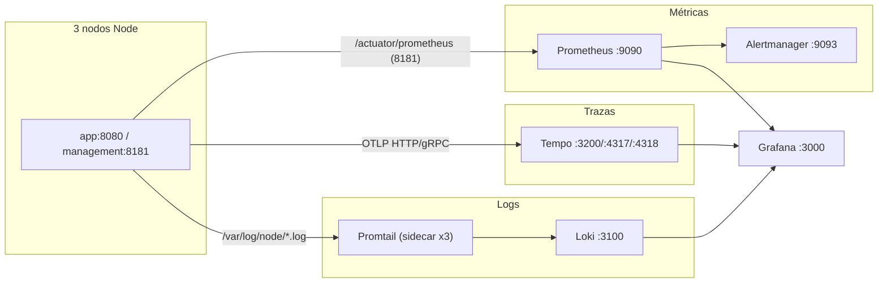

# Observability stack

Stack de observabilidad opt-in para el cluster local de 3 nodos Node. Todo vive bajo el `profile docker observability`: arrancarlo es explícito y opcional, y el flujo de smoke/CI default no lo levanta.

## Arquitectura



Tres pipelines independientes que se cruzan en Grafana:

1. **Métricas** — Prometheus scrapea `/actuator/prometheus` en el puerto management de cada nodo, evalúa reglas y reenvía alertas firing a Alertmanager.
2. **Trazas** — los nodos exportan spans OTLP (HTTP `4318`, gRPC `4317`) a Tempo. Service map sobre Prometheus.
3. **Logs** — un sidecar Promtail por nodo lee el `node.log` montado read-only, extrae los campos del pattern logback vía regex y los envía a Loki.

Grafana provisiona los tres datasources al arranque y un dashboard único (`node.json`).

## Activación

```bash
GRAFANA_ADMIN_PASSWORD=localdev docker compose --profile observability up -d --build
```

`docker compose up` sin `--profile` mantiene los 3 nodos arriba sin el stack de observabilidad — ese es el modo default para CI smoke.

`GRAFANA_ADMIN_PASSWORD` es obligatoria al activar el profile. El default declarado en el compose (`please-override-GRAFANA_ADMIN_PASSWORD-via-env`) es deliberadamente obvio: si lo ves activo en producción, alguien olvidó override.

### Puertos publicados al host

| Servicio | Puerto | Para qué |
|---|---|---|
| Prometheus | `9090` | UI + API de query |
| Grafana | `3000` | UI (admin / `$GRAFANA_ADMIN_PASSWORD`) |
| Alertmanager | `9093` | UI alertas firing |
| Tempo | `3200` | API query (Grafana) |
| Tempo | `4317` | OTLP gRPC ingest |
| Tempo | `4318` | OTLP HTTP ingest |
| Loki | `3100` | HTTP API + readiness probe |

Los sidecars Promtail no publican puerto al host; comunican con Loki por la red docker.

### Smoke del stack

```bash
bash scripts/ops/observability-smoke.sh
```

Valida `promtool check rules` + targets Prometheus `up==1` + Grafana ready.

## Por servicio

### Prometheus

[`prometheus/prometheus.yml`](prometheus/prometheus.yml). `scrape_interval=15s`, `evaluation_interval=15s`. Scrapea `/actuator/prometheus` en `node{1,2,3}:8181` (red docker only — el puerto management no se publica al host, invariante de aislamiento entre socket de aplicación y socket de management).

Reglas en [`prometheus/rules/node-alerts.yml`](prometheus/rules/node-alerts.yml). Alertas se envían a `alertmanager:9093`.

`external_labels.cluster=node-local` etiqueta este stack para distinguirlo en federaciones futuras.

### Alertmanager

[`alertmanager/alertmanager.yml`](alertmanager/alertmanager.yml). Agrupación por `alertname + severity + domain` con `group_wait=30s`, `repeat_interval=1h`. Inhibición: `severity=critical` silencia el `severity=warn` correspondiente del mismo `alertname/domain` (Google SRE, "Practical Alerting": severity merging).

El receiver es un **webhook placeholder** (`http://127.0.0.1:9999/noop`) que absorbe alertas sin destino real. Sustituir por canal productivo (Slack / PagerDuty / email) en el momento del despliegue real.

### Grafana

Auto-provision al arrancar:

- **Datasources** ([`grafana/provisioning/datasources/`](grafana/provisioning/datasources/)) — Prometheus (default), Loki (uid `loki`), Tempo (uid `tempo`).
- **Dashboards** ([`grafana/provisioning/dashboards/`](grafana/provisioning/dashboards/)) — file provider sobre `/var/lib/grafana/dashboards`. Un solo dashboard: `node.json` (Node operational dashboard).

Correlación logs ↔ trazas wired bidireccionalmente:

- **log → trace**: `derivedFields` en `loki.yml` detecta `tid=<32 hex chars>` en cualquier log line y muestra el botón **View trace in Tempo**.
- **trace → log**: `tracesToLogsV2` en `tempo.yml` adjunta `|~ "tid=<traceId>"` automáticamente al saltar a Loki desde un span. Ventana ±1m respecto al span para tolerar skew entre clocks de containers.

`anonymous=false` + `signup=false` + `embedding=false`. Acceso solo con admin/password.

### Tempo

[`tempo/tempo.yaml`](tempo/tempo.yaml). Storage filesystem (`/var/tempo/traces`, `/var/tempo/wal`), `block_retention=24h`. Sin metrics generator (no derivación local trace → métrica; los datos vienen de Prometheus). Service map sobre datasource Prometheus.

Para escalar a S3/GCS/Azure, reescribir el bloque `storage.trace.backend`.

### Loki

[`loki/loki.yml`](loki/loki.yml). Single-binary monolítico (`auth_enabled=false`, `replication_factor=1`, ring inmemory). Storage filesystem en `/tmp/loki`, schema v13 (tsdb), `retention_period=24h` con compactor activo.

Es la capa "hot" del incident response. Los logs antiguos siguen disponibles en el volume `nodelogs{N}` de cada nodo vía logback rolling (default 30d, ver `node.logging.retention-days`).

`allow_structured_metadata=true` está habilitado por compatibilidad futura — Promtail emite hoy los campos extra como contenido de línea, no como structured metadata.

### Promtail

[`promtail/promtail.yml`](promtail/promtail.yml). Sidecar por nodo (`promtail-node{1,2,3}`), comparten el mismo fichero con `NODE_LABEL` distinto vía `-config.expand-env=true`. Cada sidecar lee `/var/log/node/*.log` montado read-only desde el volume `nodelogs{N}` correspondiente.

**Pipeline de extracción** (3 stages):

1. `regex` sobre el pattern logback. Los named capture groups extraen: `timestamp`, `level`, `thread`, `logger`, `requestId`, `traceId`, `spanId`, `sessionId`, `decisionId`, `httpMethod`, `httpPath`, `message`.
2. `timestamp` del log (no del ingest) — Loki ordena chunks por este timestamp.
3. `labels` — solo `level` se promueve a label (cardinalidad acotada: 6 valores TRACE..FATAL). El resto queda en el contenido de línea.

**Label policy estricta** (invariante operativa load-bearing):

| | Valores |
|---|---|
| Labels Loki | `job`, `node`, `level` |
| Línea (no labels) | `traceId`, `requestId`, `spanId`, `sessionId`, `decisionId`, `httpMethod`, `httpPath`, `thread`, `logger`, `message` |

Razón: cardinalidad. Pocas labels con valores acotados habilitan queries como:

```logql
{job="node", node="node1", level="ERROR"} |~ "tid=abc123"
{job="node"} | logfmt | traceId="abc123"
```

**Nota crítica**: si el pattern logback en `src/main/resources/logback-spring.xml` cambia (orden, separadores o nombres de fields), hay que actualizar también el regex de Promtail. Nada lo valida automáticamente.

## Catálogo de alertas

Definidas en [`prometheus/rules/node-alerts.yml`](prometheus/rules/node-alerts.yml). Cuatro grupos por dominio funcional. Severities: `warn` (deferrable, ventana de inspección), `critical` (intervención inmediata).

### Discovery {#discovery}

Cubre el directorio de candidatos del supernodo y la retry queue.

| Alerta | Severity | Expresión | Para | Señal |
|---|---|---|---|---|
| `NodeDiscoveryQueuePendingWarn` | warn | `node_discovery_queue_pending > 5` | 5m | retry queue acumulando trabajo |
| `NodeDiscoveryQueuePendingCritical` | critical | `node_discovery_queue_pending > 10` | 5m | queue saturada, supernodo lento |
| `NodeDiscoveryQueueFailedWarn` | warn | `node_discovery_queue_failed >= 1` | 5m | hay 1+ row en fallo persistente |
| `NodeDiscoveryQueueFailedCritical` | critical | `node_discovery_queue_failed >= 5` | 5m | acumulación de fallos — hay un peer permanentemente caído o whitelist desincronizada |

### Custody liveness {#liveness}

Cubre el ciclo probe → escalation. La regla agregada se dispara cuando el escalation a `RETURN_TO_TUTOR` queda diferido por tutor inalcanzable.

| Alerta | Severity | Expresión | Para | Señal |
|---|---|---|---|---|
| `NodeCustodyEscalationDeferredSustained` | warn | `increase(node_custody_liveness_escalation_deferred_total[15m]) > 0` | 15m | el peer renueva el TTL del custody fragment porque el `POST /recovery/fragments` falla — investigar tutor del requester (caído, whitelist, WAF) |

### File integrity {#file-integrity}

Cubre el `FileIntegrityRiskOrchestrator`. Los thresholds (0.34 / 0.50) están alineados con la property `node.recovery.recompose-threshold-fraction` (default 0.34). Superarlo dispara recompose automático del archivo.

| Alerta | Severity | Expresión | Para | Señal |
|---|---|---|---|---|
| `NodeFileIntegrityRiskWarn` | warn | `max(node_recovery_file_integrity_risk_score_max) >= 0.34` | 5m | el orchestrator está actuando con frecuencia |
| `NodeFileIntegrityRiskCritical` | critical | `max(node_recovery_file_integrity_risk_score_max) >= 0.50` | 1m | archivos por encima del threshold sin poder recomponer — riesgo `FILE_UNRECOVERABLE` |
| `NodeFileIntegrityUnrecoverable` | critical | `increase(node_recovery_file_integrity_unrecoverable_total[15m]) > 0` | 1m | archivos `count(OK) < min-healthy` — intervención manual requerida |
| `NodeFileIntegrityRecomposeFailureSustained` | warn | `increase(node_recovery_file_integrity_recompose_failure_total[10m]) > 0` | 10m | recompose failures sostenidos — investigar peers / red / quota |

`FILE_UNRECOVERABLE` significa que el archivo no se puede recomponer ni siquiera teóricamente. Es un estado terminal: el operador re-sube desde origen, restaura desde backup externo o acepta pérdida.

### Recovery {#recovery}

Cubre el worker de cleanup periódico que reconcilia divergencias metadata/payload.

| Alerta | Severity | Expresión | Para | Señal |
|---|---|---|---|---|
| `NodeRecoveryCleanupErrorRatioWarn` | warn | `increase(error[10m]) / clamp_min(increase(total[10m]), 1) > 0.005` | 10m | ratio de error >0.5% — cleanup empezando a fallar |
| `NodeRecoveryCleanupErrorRatioCritical` | critical | `... > 0.02` | 10m | ratio >2% — el worker no está convergiendo |

## Política de recalibración de umbrales

Los umbrales actuales son **v1**: calibrados (2026-04-25) contra un game day operativo + smoke tests, sin desviación observada que justifique cambio numérico.

**Recalibración v2** mandatoria si se cumple cualquiera:

- 30 días de tráfico productivo continuo (cluster real, no smoke).
- Primer post-mortem de incidente atribuible a un threshold mal calibrado.
- Cambio arquitectural que duplique (≥2x) la capacidad o el throughput esperado.

## Naming + invariantes de observabilidad

- **Métricas Prometheus**: `node_<domain>_<metric>[_unit]`. Sufijo `_total` en counters monotónicos, `_seconds` en métricas temporales. Labels acotadas (`status`, `outcome`, `severity`, `domain`); prohibido IDs / tokens / paths arbitrarios en labels.
- **Spans tracing**: `node.<modulo>.<operacion>` snake_case con dot-notation. Tags acotados a baja cardinalidad; prohibido tokens, firmas, payloads.

## Añadir una métrica + alerta nueva

1. **Definir el contador / gauge en el `*ObservabilityService`** del módulo correspondiente. Es la fuente de verdad del valor; nunca instrumentes en controllers ni event sites.
2. **Registrar la métrica en [`PrometheusMetricsBridge`](../../src/main/java/es/ual/node/bootstrap/observability/PrometheusMetricsBridge.java)** con `FunctionCounter.builder(...)` o `Gauge.builder(...)` apuntando al supplier `service.snapshot().campo()`.
3. **Test unitario MeterRegistry-based** — copia [`PrometheusMetricsBridgeTest`](../../src/test/java/es/ual/node/bootstrap/observability/PrometheusMetricsBridgeTest.java) como plantilla.
4. **Regla opcional en [`prometheus/rules/node-alerts.yml`](prometheus/rules/node-alerts.yml)** + entrada en este catálogo de alertas (sección por dominio).

Al añadir una alerta nueva, fija severity (`warn`/`critical`), `for:` (ventana antes de disparar), `runbook` (link relativo a `docker/observability/README.md#<dominio>`), y `summary` (texto operativo, no jerga interna).

## Operaciones útiles

```bash
# Ver alertas firing
curl -s http://localhost:9093/api/v2/alerts | jq '.[] | {alertname: .labels.alertname, severity: .labels.severity}'

# Ver targets up
curl -s http://localhost:9090/api/v1/targets | jq '.data.activeTargets[] | {url: .scrapeUrl, up: .health}'

# Reload Prometheus tras editar reglas (sin restart)
curl -X POST http://localhost:9090/-/reload

# Snapshot operativo (paneles + alertas) firmado
bash docker/scripts/ops-observability-dashboard-alerts.sh --node-index 3 --username <admin> --password <...>
```
