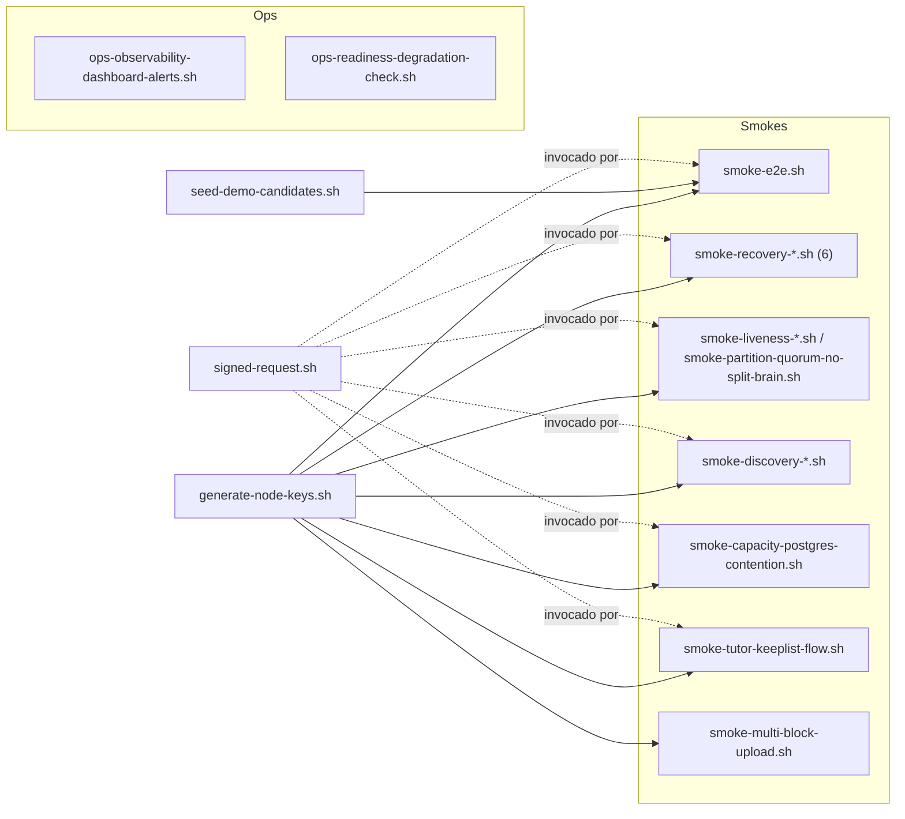

# `docker/scripts/`

Scripts operacionales del cluster local de 3 nodos Node. Tres familias:

- **Helpers internos** — invocados por los smokes (`signed-request.sh`, `generate-node-keys.sh`, `seed-demo-candidates.sh`).
- **Smokes de regresión** — flujos end-to-end firmados que validan invariantes del modelo cerrado.
- **Scripts ops standalone** — snapshots y health checks autenticados (`ops-observability-dashboard-alerts.sh`, `ops-readiness-degradation-check.sh`).

## Grafo de dependencias



Todos los smokes hacen `generate-node-keys.sh` lazy (si `docker/keys/node1-private.der` no existe). `signed-request.sh` se invoca de dos formas: como script (`bash docker/scripts/signed-request.sh ...`) y como helper inline (los smokes copian las funciones `signed_json_call` / `signed_binary_get` y las usan directamente).

## Helpers internos

### `generate-node-keys.sh`

Genera 3 pares ECDSA P-256 (DER + base64) y deriva los nodeIds canónicos `node-<24hex>` (primeros 24 chars del SHA-256 de la clave pública). Salidas:

- `docker/keys/node{1,2,3}-{private,public}.{der,b64}` — material criptográfico.
- `docker/keys/node{1,2,3}-id.txt` — nodeId derivado.
- `docker/env/node{1,2,3}.env` — variables de entorno por nodo con identidad + whitelist (`NODE_IDENTITY_TRUSTED_PUBLIC_KEYS`, `NODE_TOPOLOGY_TUTOR_ACCEPTED_PUBLIC_KEYS`, `NODE_TOPOLOGY_ACCEPTED_FRAGMENT_SENDER_KEYS`).

Además **sincroniza in-place el `docker-compose.yml`**: el bloque `SPRING_APPLICATION_JSON.custody-liveness.remote-base-urls` mapea `nodeId(hash) → baseUrl docker interno`. Sin sync, los hashes nuevos no resuelven a peers y custody-liveness lanza `IllegalStateException: No remote base URL configured for nodeId ...`.

```bash
bash docker/scripts/generate-node-keys.sh
```

Idempotente: cada ejecución regenera fresh. Los smokes detectan ausencia de keys y lo invocan automáticamente.

### `signed-request.sh`

Constructor reutilizable de requests HTTP firmadas inter-nodo (ECDSA-SHA256). Firma sobre la canónica de 5 campos `(method, path, query, nonce, timestamp)` y emite los headers `X-Node-Id`, `X-Nonce`, `X-Timestamp`, `X-Signature-Algorithm`, `X-Signature` requeridos por todos los endpoints `/ops/**`.

```bash
bash docker/scripts/signed-request.sh <node_index:1|2|3> <method> <base_url> <path> [json_payload_file]
```

Salida: response HTTP completa con headers + body. La mayoría de smokes copian las funciones helper inline (`signed_json_call`, `signed_binary_get`) en lugar de invocar el script.

### `seed-demo-candidates.sh`

Bootstrap del directorio de candidatos del supernodo discovery. Sin candidatos seedeados, el flujo de upload falla con `INSUFFICIENT_CUSTODIANS` porque `DiscoveryService.discover(...)` devuelve lista vacía.

Registra los 3 nodos como candidatos en cada uno de los 3 directorios (cada nodo se firma a sí mismo) con asignación de `failureDomain`:

| Nodo | failureDomain | URL interna docker | URL externa host |
|---|---|---|---|
| node1 | `zone-a/rack-1` | `http://node1:8080` | `http://localhost:8081` |
| node2 | `zone-b/rack-1` | `http://node2:8080` | `http://localhost:8082` |
| node3 | `zone-c/rack-1` | `http://node3:8080` | `http://localhost:8083` |

```bash
bash docker/scripts/seed-demo-candidates.sh
```

El supernodo persiste el `baseUrl` del candidate junto con el `nodeId`; los origenes lo usan para resolver `discoveredNodeId → URL custodia` sin consultar la topology config local. Las URLs internas docker (8080) son las que viajan en custody — las externas (8081/8082/8083) sólo sirven al host.

## Smokes de regresión

Las flags `--keep-running`, `--no-build`, `--reuse-keys`, `--fast` (= `--no-build --reuse-keys --keep-running`) son comunes a todos los smokes salvo donde se indique. Tiempo típico de ejecución: 30 s – 3 min en `--fast`, 3 – 8 min con build completo.

### Upload + distribución

#### `smoke-e2e.sh`

Smoke base end-to-end. Levanta cluster + ejecuta el flujo signed completo (discovery query → negotiation create/confirm → recovery store/get) con validación SQL contra postgres. Es el smoke de referencia: si éste falla, no hace falta seguir.

#### `smoke-multi-block-upload.sh`

Sube un archivo de 8 MiB (≥2 bloques RS con `block-size=4 MiB`) y valida:

1. `PUT /files/entries/{id}/content` streamea bloque por bloque (no carga en memoria).
2. El manifest se replica al tutor con `client_blocks_json` no nulo (BlockManifest serializado).
3. `GET /files/entries/{id}/content` reconstruye los bloques (k de n fragments por bloque) → SHA-256 idéntico al original.

Cubre el path multi-block; el resto de smokes usan archivos < 4 MiB y caen en el path syntheticSingleBlock.

### Recovery flows

Los seis smokes de recovery cubren el flow tutor custody, escalation, restore mode.

#### `smoke-recovery-bytes.sh`

Validación mínima: `POST /recovery/fragments` (octet-stream) + `GET /recovery/fragments/{id}/content`, verifica checksum del round-trip.

#### `smoke-recovery-full-flow.sh`

Simula un outage: node1 → node2 (tutor) almacena → stop node3 → node1 recupera → restart node3 → node3 recupera + verifica contenido. Cubre el caso "el tutor sirve fragments cuando un nodo común vuelve después de outage".

#### `smoke-recovery-octet-stream.sh`

Path binario explícito: `POST /recovery/fragments` con `Content-Type: application/octet-stream` + headers `X-Fragment-Id` / `X-Checksum` / `X-Fragment-Size` / etc., y `GET` equivalente para verificar round-trip de bytes.

#### `smoke-recovery-bytes-from-tutor.sh`

Flujo `BYTES_FROM_TUTOR`. Escenario:

1. Upload normal + backup users.
2. Migración `custody → recovery_orphan` simulada vía SQL (las filas de `custody_fragment` + payload se copian a `recovery_orphan_fragment` en el tutor; luego se borran de `custody_fragment`).
3. Stop node1 + reinicio con `NODE_RECOVERY_MODE=RESTORE`.
4. Bootstrap runner pulla manifests + reconstruye catalog + pulla bytes del tutor.
5. Cliente login + download → bytes idénticos al original (vía fallback a blob local).

`recovery_orphan_fragment` no lleva `expires_at` (sin TTL) — el smoke valida que el path bytes-from-tutor reemplaza correctamente al "fetch from peers" cuando los peers ya no tienen los fragments.

#### `smoke-recovery-restore-mode.sh`

Flow end-to-end. Escenario:

1. Cluster up + cliente registra usuario en node1, sube 1 archivo.
2. Verifica replicación: `client_file_manifest@node1` + `recovery_file_manifest@node2` (tutor) + `custody_fragment@nodes` con `clientPlacementsJson` + `clientBlocksJson` no nulos.
3. Backup users de node1 (pg_dump in-container).
4. Fatal failure: stop node1 + drop volume Postgres + restart limpio + restore users.
5. node1 arranca con `NODE_RECOVERY_MODE=RESTORE`.
6. Verifica que el bootstrap runner reconstruyó `fs_entry` + `client_file_manifest` + `client_fragment_placement`.
7. Cliente login + `GET /fs/tree` retorna el archivo + `GET content` lo descarga reconstruyendo desde peers vivos.

#### `smoke-recovery-consistency-restart.sh`

Worker de consistency post-restart. Levanta cluster con cadencia determinista del worker en node2, crea divergencia metadata/payload borrando un row directamente en postgres-node2, reinicia node2 y verifica que la metadata huérfana se elimina y el control fragment sobrevive. Valida también el endpoint `/ops/recovery/consistency/metrics`.

### Custody liveness + retorno-a-tutor

#### `smoke-liveness-return-to-tutor.sh`

Levanta cluster con `liveness + recovery` activos en node3 (custodian), seedea custody fragment con `requesterNodeId=node1`, para node1 (origen unresponsive), dispara probe-now y verifica que la sesión llega a `ESCALATED` y el fragment migra de `custody_fragment@node3` a `recovery_orphan_fragment@node2`.

Soporta `--bootstrap-{e2e,recovery-full,recovery-bytes,recovery-octet}` para reusar otro smoke como bootstrap del cluster.

#### `smoke-partition-quorum-no-split-brain.sh`

Valida la invariante load-bearing **"una tabla = un dominio = un port"**: el escalation `custody → recovery_orphan_fragment` debe **mover** (no copiar). Post-`RETURN_TO_TUTOR` el fragment vive sólo en `recovery_orphan_fragment@tutor` y desaparece de `custody_fragment@custodian`. Una regresión a "copy" produciría double-storage cross-table (split-brain a nivel BD), detectado por SQL pre/post + métricas + idempotency check del segundo probe-now sobre sesión `ESCALATED`.

### Discovery

#### `smoke-discovery-dynamic-distribution.sh`

Cuatro escenarios sobre cluster con override que reduce los intervalos de renewal/cleanup/freshness a segundos (smoke termina en <2 min):

1. **Distribución dinámica**: un upload reparte n=3 fragments en 3 baseUrls distintos (invariante 1-fragment-per-node-per-file).
2. **Cleanup periódico**: tras parar un nodo, su candidate desaparece del directorio.
3. **Renewal periódico**: tras restart, el `SelfDiscoveryRenewalWorker` lo re-anuncia.
4. **Insufficient candidates**: con sólo 1 baseUrl único disponible, upload con n=3 aborta con HTTP 503 `INSUFFICIENT_CUSTODIANS`.

#### `smoke-discovery-liveness-chaos.sh`

Discovery + liveness bajo degradación: request sin candidatos → `PENDING`, inyectar candidate temporal → `RESOLVED`, pause node1 → escalation probe a tutor, unpause → recovery en BD + métricas observability.

### Capacity admission

#### `smoke-capacity-postgres-contention.sh`

Valida el ledger durable de capacidad bajo contención concurrente. Levanta cluster con capacidad reducida en node2, crea dos negotiations PENDING que confirmarían contra esa capacidad limitada, corre los `confirm` en paralelo (uno gana / uno pierde por write conflict), reintenta el perdedor con fresh signature (debe seguir fallando) y verifica estados HTTP + filas postgres.

### Tutor flow

#### `smoke-tutor-keeplist-flow.sh`

Smoke de los endpoints HTTP del flujo tutor-iniciado:

1. `POST /recovery/file-manifests` (custodia proactiva).
2. `GET /ops/tutor/manifest-keep-list`.
3. `GET /recovery/file-manifests/inventory`.
4. `POST /recovery/fragments`.
5. `POST /recovery/orphan-fragments/{id}/claim`.
6. `POST /recovery/orphan-fragments/{id}/ack`.
7. `GET (claim) tras ACK` → 404.

## Scripts ops standalone

Ambos requieren autenticación real (firma inter-nodo + Bearer admin). Producen JSON estructurado y exit codes que pueden encadenarse en CI.

### `ops-observability-dashboard-alerts.sh`

Snapshot de paneles operativos + evaluación de reglas iniciales de alerta sobre endpoints `/ops/**` autenticados. Consume:

- `docker/observability/panel-catalog.json` — catálogo de paneles operativos (qué endpoints + qué fields).
- `docker/observability/alert-rules.json` — reglas iniciales (umbrales discovery / liveness / recovery).

Flags:

```
--node-index <1|2|3>     índice de nodo local para firma (default: 3)
--base-url <url>         URL base objetivo (default por node-index: 8081/8082/8083)
--token <bearer>         Token Bearer ya emitido por /auth/login
--username <u> --password <p>  obtener token automáticamente
--output <file>          archivo JSON de salida (default: logs/ops-observability/snapshot-*.json)
--fail-on-warn           devuelve exit code WARN (10) cuando existan alertas warn
```

| Exit code | Significado |
|---|---|
| 0 | OK |
| 10 | WARN (con `--fail-on-warn`) |
| 20 | CRITICAL |

### `ops-readiness-degradation-check.sh`

Evalúa el estado de readiness/health endurecido sobre `/ops/system/readiness`. Clasifica en:

| Exit code | Significado |
|---|---|
| 0 | READY (o DEGRADED si `--allow-degraded`) |
| 10 | DEGRADED |
| 20 | NOT_READY |

Salida: JSON estructurado en `logs/ops-readiness/check-*.json` (default).

## Convenciones

- **Flags estándar**: `--keep-running`, `--no-build`, `--reuse-keys`, `--fast`. La flag `--fast` siempre equivale a `--no-build --reuse-keys --keep-running` (o subset según el smoke).
- **Cleanup automático**: salvo `--keep-running`, todos los smokes corren `docker compose down -v` al salir (trap EXIT). Algunos smokes con override compose persistente eliminan también el override antes del `down`.
- **Volúmenes Docker**: `nodelogs{1,2,3}` (logs por nodo, montados ro por sidecars Promtail si el profile observability está activo) + `node_postgres_data{1,2,3}` (data dir Postgres por nodo). El smoke base levanta sólo los 3 nodos + 3 Postgres.
- **Tiempo típico**: 30 s – 3 min en `--fast` (reusa imagen + keys), 3 – 8 min con build completo.
- **Seed de candidatos**: `seed-demo-candidates.sh` se invoca desde `smoke-e2e` y otros smokes que necesitan candidatos discovery activos. Si lanzas un smoke standalone que requiere candidatos seedeados sin pasar por `smoke-e2e`, hazlo manualmente tras `docker compose up`.
